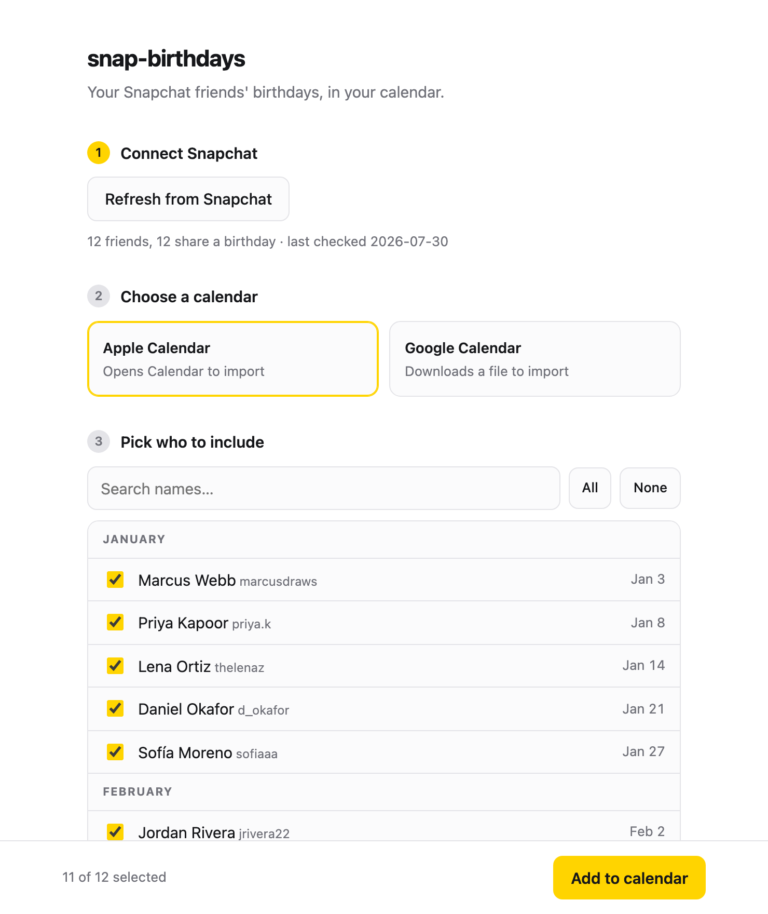

# snap-birthdays

Put your Snapchat friends' birthdays in your calendar. One file, one dependency.

Snapchat has no API for this, but its web app fetches every friend's birthday in a single
response when it loads. So this opens a real browser, lets you log in by hand, reads that
one response as it goes past, and writes an `.ics` file.

```
427 birthdays from 564 friends (137 keep theirs private)
Wrote /Users/you/.snap-birthdays/snapchat-birthdays.ics
```

## Setup

```bash
pip install playwright && playwright install chromium
```

## Use

```bash
python ui.py
```

That's the whole thing: it opens a page in your browser with four steps — connect
Snapchat, pick Apple or Google Calendar, tick the people you want, import. Your
selection is remembered, so the next run starts where you left off, and anyone who
adds you on Snapchat later shows up already ticked.



The server is local-only (`127.0.0.1`, random port, random token per run) and stops
when you press Ctrl-C.

### Or from the terminal

```bash
python snapbirthdays.py                 # fetch, then open the file in Calendar (macOS)
python snapbirthdays.py --to google     # ...or open Google Calendar's import page
python snapbirthdays.py --to file       # ...or just write the .ics and stop
```

A browser window opens. Log in if it asks; after the first time the session is remembered
in `~/.snap-birthdays/chrome-profile`, so later runs need nothing from you. Once the
friend data goes past, the window closes on its own.

### Apple Calendar

The default. Calendar opens and asks which calendar to add to — **make a new one** rather
than dumping 400 birthdays into your main calendar, so you can hide or delete the whole
lot in one action later.

### Google Calendar

`--to google` opens the import page and selects the `.ics` in Finder. Drag it in, pick a
calendar, hit Import. There's no way to automate this without OAuth credentials and a
Google Cloud project, which is a lot of machinery for something you'll run twice a year.

### Options

| flag | what it does |
| --- | --- |
| `--to apple\|google\|file` | where to send it (default: `apple` on macOS, else `file`) |
| `--out PATH` | where to write the `.ics` |
| `--calname NAME` | calendar name embedded in the file |
| `--timeout SECONDS` | how long to wait for login + data (default 300) |
| `--from-file PATH` | decode a saved response instead of opening a browser |

## Re-running won't duplicate anything

Each event's `UID` is derived from the friend's Snapchat username, which never changes.
Calendars treat a matching UID as the same event, so importing again updates what's there
instead of adding a second copy. Deliberately not keyed on the display name or the
birthday, since a friend can edit both — rename themselves and you get a renamed event,
not a duplicate.

## Things worth knowing

**This will break eventually.** It depends on the internal shape of a Snapchat response.
Nothing stops them changing it. If a run reports friends but no birthdays, or no friends
at all, the field numbers near the top of the script are the place to look.

**Only month and day.** Snapchat never exposes birth years, so events recur yearly with
no age. Friends who keep their birthday private are silently skipped — that's the
`137 keep theirs private` in the output above.

**Leap days** anchor to Feb 28. A yearly rule anchored on Feb 29 only fires every four
years in most calendar apps, which is not what you want.

**It runs headed, always.** Snapchat doesn't issue the friend sync in a headless browser,
so there'd be nothing to capture. A `--headless` flag would just hang.

**It's against Snapchat's terms of service.** It's your own account reading your own
friends' birthdays, so the legal exposure is somewhere around nil, but automating a
logged-in session is not something they permit. Don't put it on a cron; run it when you
actually want your calendar updated.

## Tests

```bash
python3 -m pytest
```

68 tests, no network and no browser — the protobuf decoder runs against synthetic
payloads, the calendar writer against hand-built friends, and the UI's API surface
against a real server on a random port.

## Credit

The protobuf decoding is adapted from
[Snap2Calendar-Birthday-Export](https://github.com/J4A-Industries/Snap2Calendar-Birthday-Export)
by James Arnott (MIT), which works out the field numbers and does the same job as a
browser extension. This started out also supporting Facebook via
[fb2cal](https://github.com/mobeigi/fb2cal), but Facebook's birthday page no longer
issues the GraphQL query that approach depends on, so that half was cut.

MIT licensed.
